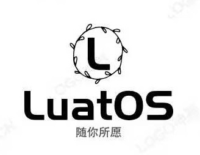

<p align="center"><a href="#" target="_blank" rel="noopener noreferrer"></a></p>

[](https://gitee.com/openLuat/LuatOS/stargazers)
[](https://gitee.com/openLuat/LuatOS/members)
[](/LICENSE)

LuatOS : Powerful embedded Lua Engine for IoT devices, with many components and low memory requirements (16K RAM, 128K Flash)

Powerful Lua engine, highly optimized for MCU and IoT devices, supports many components, and has very low memory requirements (minimum 16K RAM, 128K Flash).

## Quick Start

1. Use or purchase a supported development board
* [Air780EPV-4G Cat.1 Development Board](https://luat.taobao.com)
* [Air780E-4G Cat.1 Development Board](https://luat.taobao.com)
* [PC - emulator without development board](https://gitee.com/openLuat/luatos-soc-pc)
2. Master [flash](https://wiki.luatos.com/boardGuide/flash.html)
3. Try [various demos](https://gitee.com/openLuat/LuatOS/tree/master/demo), browse [API](https://wiki.luatos.com/api/index.html), [30-minute introduction to Lua grammar (video)](https://www.bilibili.com/video/BV1vf4y1L7Rb?spm_id_from=333.999.0.0)
4. Have fun writing business code

## Complete information

* [wiki@luatos](https://wiki.luatos.com)
* [LuatOS Document Pool](https://gitee.com/openLuat/luatos-doc-pool)

## License Agreement

[MIT License](LICENSE)

```lua
print("Thank you for using LuatOS ^_^")
print("Thank you for using LuatOS ^_^")
```
