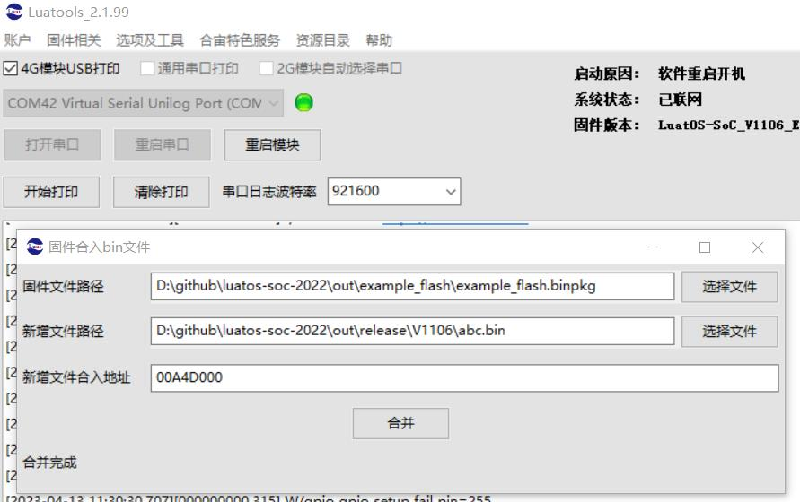

# illustrate

* On-chip flash reading and writing demonstration

## Instructions for flashing data to the specified flash address during mass production flashing

remind:
1. Supports brushing into multiple areas, but requires multiple synthesis
2. Use ordinary Multidownload

Usage scenarios:
1. Flash a custom file system image
2. Flash TTS data to the specified location

## Operation steps, taking a single area as an example

### The first step is to determine the address/size/name to be flashed.

Example:

Address: 0x00A4D000
File: abc.bin no format requirement, can be any content

### The second step, open LuaTools for merging

Main interface, options and tools, firmware merge file tool

Select the binpkg file as shown in the picture, the file to be merged, fill in the address, and click Synthesis

After completion, a new binpkg will be generated in the directory where binpkg is located. Use this binpkg to flash the machine. It is compatible with the ordinary MulitDownload program.

### To add more clips

Repeat step 1/2, but select the newly generated binpkg in the second step

Note: The merged addresses must be in ascending order, otherwise they will not succeed.
